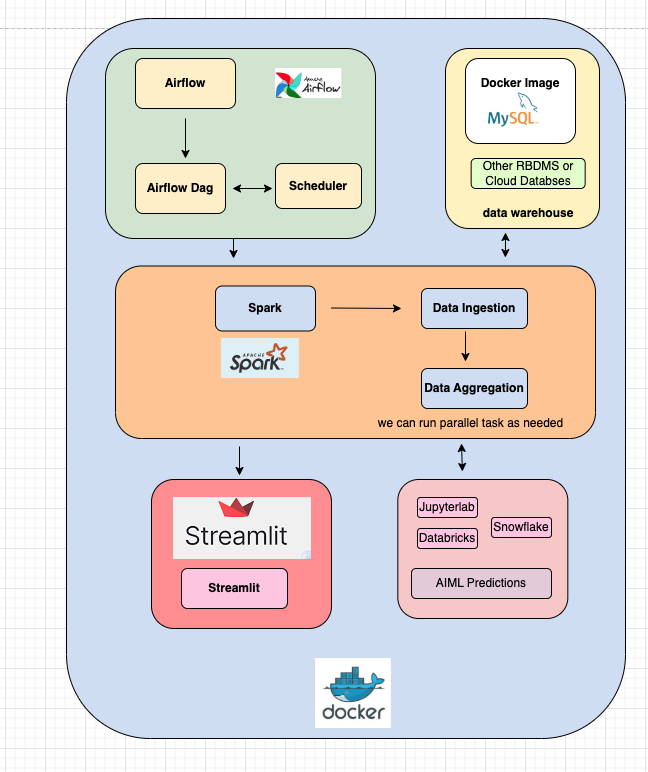
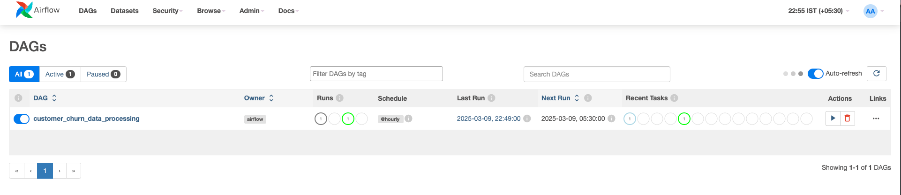
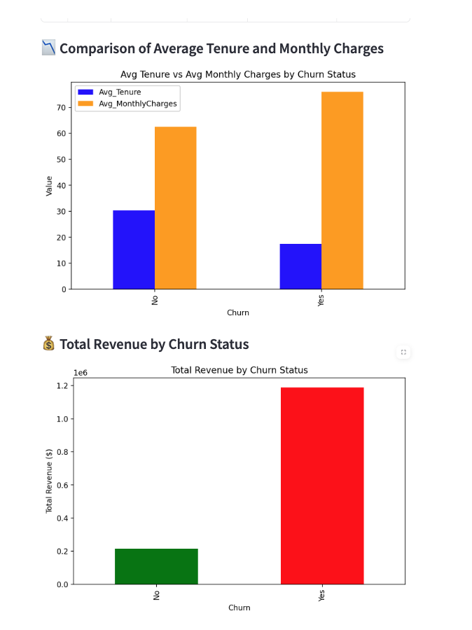

- Application Flow
- 

- ETL Pipeline
  - Source: CSV file
  - Target: Mysql (installed through docker-compose)
  - Processing - Used spark and read file in chunk to make sure it works for large files
  - Visualization: Streamlit (installed through docker-compose)
- Clone repository https://github.com/sachin-gaikhe/data-pipeline-example.git
- mkdir airflow
- cd airflow
- gh repo clone sachin-gaikhe/data-pipeline-example
- cd <folder>
- mkdir -p ./dags ./logs ./plugins
- docker-compose up -d # to start containers
- docker-compose down # to stop containers
- How to access
  - Airflow UI: http://localhost:9090/
    - user:=admin
    - password:=admin
  - Spark UI:
    - http://localhost:8080
    - http://localhost:8081
  - StreamLit UI: http://localhost:8501/
- Add spark_config connection
  - Type:=Spark
  - Host:=spark://spark (for local)
  - Host:=spark://spark-master  (for cluster)
  - port:=7077
- Add Visualizations
  - docker-compose down streamlit-app and modify [customer_churn_visualization.py](streamlit/customer_churn_visualization.py)
  - docker-compose build streamlit-app
  - docker-compose up streamlit-app -d
- Note:
  - Spark job sometime may get hung id local machine not have proper resources

Add more users to Airflow if needed:
- airflow users create  --username airflow --password airflow --firstname airflow --lastname airflow --role Admin --email airflow@example.com

- MySQL ETL User if needed
  - Grant permission to etl_user after creation 
  - GRANT ALL PRIVILEGES ON *.* TO 'etl_user'@'%'; 
  - FLUSH PRIVILEGES;

- **Screens**
  - **Containers** 
    - Individual Container
      - 
    - Combined Container
      - 
  - **Dags Run**
    - 
    - 
- **Spark Job**
  - 
- **Output Tables**
  - 
- **Streamlit Reports**
 - 

Notes:
- For Airflow scaling we can use below executor for scaling 
  - CeleryExecutor for multiple worker nodes 
  - KubernetesExecutor for highly scalable and auto-scaling
- For Scalability We can enhance with adding below Airflow operators 
  - Use EmrContainerOperator if running Spark on EMR on EKS. 
  - Use EmrStepOperator if running Spark on a long-running EMR cluster. 
  - Use EmrCreateJobFlowOperator if you need on-demand clusters.
- Instead of Docker MYSQL we can use any cloud database like Snowflake,Postgres in production
- Use Environment-Specific Configuration Files 
  - instead of modifying airflow.cfg directly, create separate configuration files for each environment:
    - airflow_dev.cfg 
    - airflow_qa.cfg 
    - airflow_prod.cfg
- Deployment
  - Airflow in Kubernetes we can refer [deploy.sh](airflow/deploy/deploy.sh)
  - We can use terraform for deployments